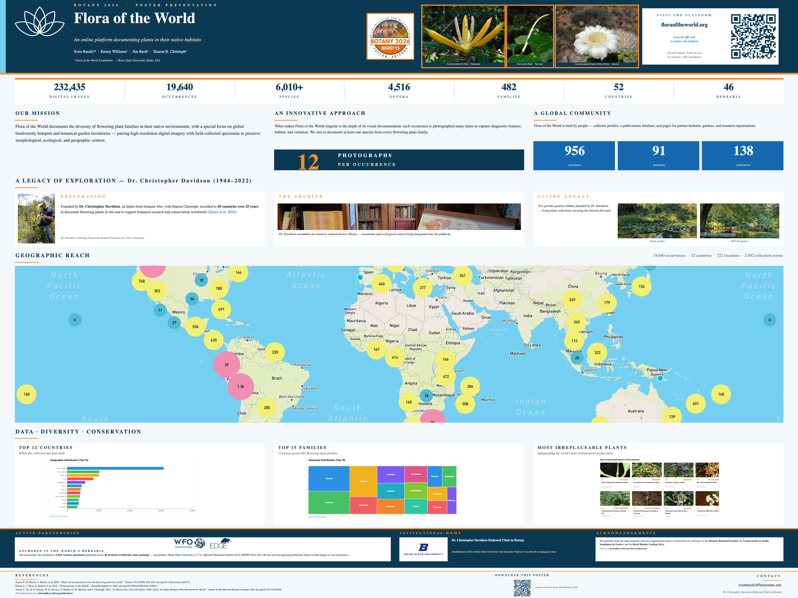

# Flora of the World — Botany 2026 Poster

Poster presented at **[Botany 2026](https://2026.botanyconference.org/)** introducing
[**Flora of the World**](https://floraoftheworld.org/) — an online platform
documenting flowering plants in their native habitats.

**Title:** *Flora of the World: An online platform documenting plants in their
native habitats*

**Authors:** Sven Buerki¹², Kenny Williams¹, Jim Beck², Sharon R. Christoph¹
&nbsp;&nbsp;&nbsp;¹ Flora of the World Foundation &nbsp;·&nbsp;
² Boise State University, Idaho, USA



---

## Abstract

*Flora of the World* was founded by the late Dr. Christopher Davidson (1944–2022),
an Idaho-born botanist and advocate for plant exploration and conservation. Over
more than 25 years, Dr. Davidson and his wife, Sharon Christoph, traveled to 45
countries to document flowering plants *in situ* and support botanical research
and conservation worldwide. The project combines high-resolution digital imagery
with field-collected specimens to document flowering plant families worldwide,
with a special focus on global biodiversity hotspots and botanical garden
inventories, capturing morphological, ecological, and geographic context. What
makes *Flora of the World* singular is the depth of its visual documentation:
each georeferenced occurrence is represented by an average of **12 detailed
photographs** capturing diagnostic features, habitat context, and morphological
variation — a standard that serves taxonomists, ecologists, conservation
biologists, and educators alike. In 2024, the **Dr. Christopher Davidson
Endowed Chair in Botany** was established at Boise State University (Idaho,
USA), creating a lasting institutional home for this mission, with Associate
Professor Sven Buerki as inaugural chair.

To make this legacy openly accessible, *Flora of the World* has been
implemented as a searchable online platform
([floraoftheworld.org](https://floraoftheworld.org/)), hosting **232,414
images** spanning **482 families**, **4,526 genera**, and **more than 6,000
species**, underpinned by **nearly 20,000 georeferenced occurrence records**.
The platform provides individual collector profiles linked to occurrences and
publications, a database of research incorporating *Flora of the World* data,
and institutional webpages dedicated to partner herbaria, gardens, and research
organizations — making invisible labor visible and fostering reciprocal
collaboration.

*Flora of the World* also participates in the **World Flora Online** project,
advancing **Target 1 of the Global Strategy for Plant Conservation**. Through
this partnership, its openly shared images, specimens, and metadata directly
strengthen this global endeavor.

Rooted in decades of field exploration and now anchored at Boise State
University, *Flora of the World* demonstrates that community-built botanical
infrastructure can become a living digital resource serving science,
education, and conservation worldwide. We warmly welcome collaborations and
contributions from the global botanical community to carry forward the
extraordinary mission Dr. Davidson began — and to ensure the world's
flowering plants, documented in their native habitats, remain a shared
heritage for generations to come.

---

## Deliverables

| File | Format | Notes |
|---|---|---|
| `Flora_of_the_World_Botany2026_Poster.pptx` | PowerPoint | 48″ × 36″ landscape, single slide, editable in PowerPoint / Keynote |
| `Flora_of_the_World_Botany2026_Poster.pdf`  | PDF | Print-ready export at 48″ × 36″ |
| `Flora of the World_Botany_Abstract.docx`   | Word | Conference abstract |
| `build_poster.py`                           | Python | Generator script (rebuilds the PPTX from `figures/`) |
| `figures/`                                  | dir | All photos, logos, charts, map, QR code used in the poster |

## Rebuilding the poster

```bash
python3 -m venv .venv
.venv/bin/pip install python-pptx Pillow qrcode cairosvg
.venv/bin/python build_poster.py
```

The script reads all assets from `figures/` and writes
`Flora_of_the_World_Botany2026_Poster.pptx`.

## Sections of the poster

* **Header** — Title, authors, three native-habitat photos
  (*Freycinetia biloba*, *Piper auritum*, *Carnegiea gigantea*), URL pill with QR code
* **Stat strip** — 232,435 images · 19,640 occurrences · 6,010+ species ·
  4,516 genera · 482 families · 52 countries · 46 herbaria
* **Our Mission** · **An Innovative Approach** (12 photographs per occurrence) ·
  **A Global Community**
* **A Legacy of Exploration** — Dr. Christopher Davidson (1944–2022) with photos
  of his field work, natural-history library, and the Boise & McCall gardens
* **Geographic Reach** — full-world occurrence map
* **Data · Diversity · Conservation** — Top 12 countries, Top 15 families,
  Most-irreplaceable EDGE plants
* **Active Partnerships** — World Flora Online & EDGE; herbarium digitisation initiative
* **Institutional Home** — Dr. Christopher Davidson Endowed Chair in Botany, Boise State University
* **References** & contact

## Cited references

* Forest, F., R. Brown, S. Buerki, et al. 2026. *"High risk of extinction across the flowering plant tree of life."* **Science** 392 (6798): 655–659. <https://doi.org/10.1126/science.adz0773>
* Forest, F., J. Moat, E. Baloch, et al. 2018. *"Gymnosperms on the EDGE."* **Scientific Reports** 8: 6053. <https://doi.org/10.1038/s41598-018-24365-4>
* Taylor, C. M., R. E. Gereau, W. D. Stevens, S. Buerki, O. M. Montiel, and S. Christoph. 2023. *"In Memoriam: Chris Davidson (1944–2022), the Idaho Botanist Who Botanized the World."* **Annals of the Missouri Botanical Garden** 108. <https://doi.org/10.3417/2023858>

Full publication list at <https://floraoftheworld.org/publications>.

## License

Released under the **Creative Commons Attribution 4.0 International (CC BY 4.0)**
license — see [LICENSE](LICENSE). Free to share and adapt with attribution to
the authors above.
